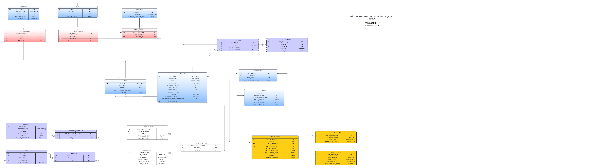
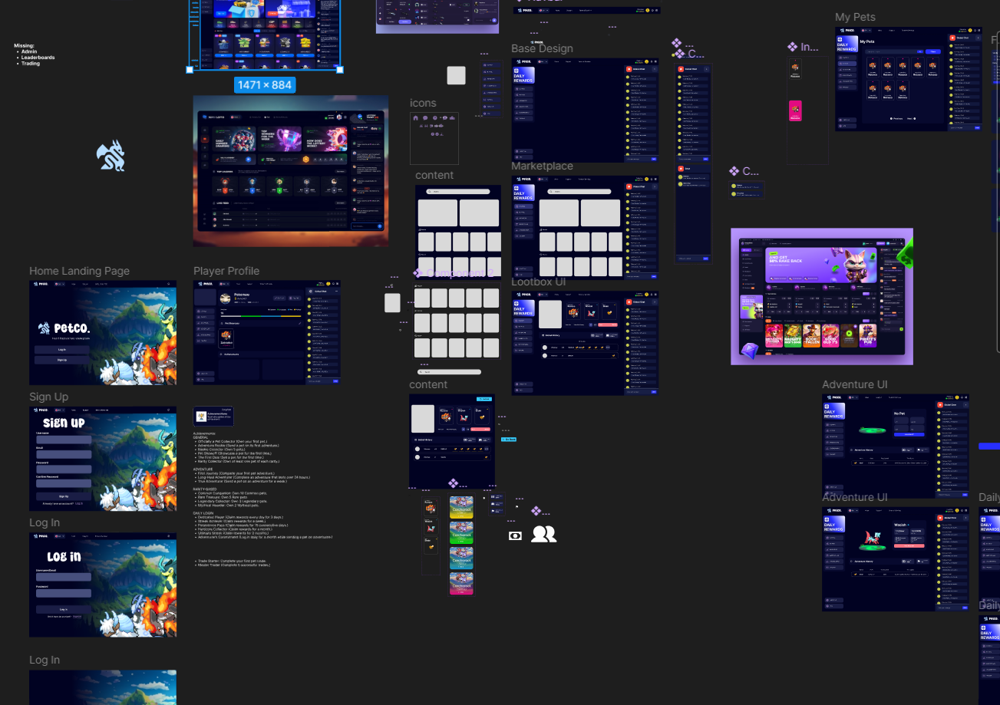

# PETCO | VIRTUAL PET GACHA SYSTEM
An online browser-based pet collection game.

## Acknowledgement
This project is developed by:
- [Jaranilla, Raya Lindley D](https://github.com/rayalindley)
- [Repunte, Frenz Nicole K.](https://github.com/chimaryder)
- [Tolentino, Tristan James Y.](https://github.com/tr-ggr)

## I. Introduction

The Virtual Pet Gacha System is an innovative online platform that allows players to collect, trade, and manage virtual pets while interacting with a simple but engaging in-game economy. Players can earn coins through specific activities such as daily logins, sending pets on adventures to gather rewards, and selling pets to others. This gacha-based system offers a fun and dynamic experience by rewarding players with random pets of varying rarities, creating an element of excitement and surprise.

Designed to provide a rewarding and community-driven experience, this system also includes trading functionalities where players can exchange pets, creating a social element. An integrated admin panel helps monitor player activity, manage accounts, and oversee the in-game economy, ensuring a balanced and fair environment. The platform is built to evolve, allowing future updates and improvements to enhance player engagement.

## II. System Overview
The Virtual Pet Gacha System is a web-based platform focused on pet collection, trading, and passive earnings. Players engage with pets, other users, and the in-game economy through various interactive mechanics.

### Core Features :
1. [***User Login & Registration***](#31-user-loginregistration)
    - Players sign up with an email, password, and username, selecting a starter pet to begin their journey.
      
2. [***User Inventory***](#32-user-inventory)
    - A personal inventory allows players to manage pets, view stats and rarities, and send pets on adventures for passive coin earnings.
      
3. [***Gacha System***](#33-gacha-system-loot-boxes)
    - Players can roll for new pets using in-game currency, with pets having varying rarity levels to add excitement to the collection process.
      
4. [***Passive Earning System***](#34-passive-earning-system-daily-login-pet-earnings)
    - Coins are earned through daily logins and sending pets on adventures, encouraging ongoing engagement and progression.
      
5. [***Pet Market***](#35-pet-market-buy-pets-sell-pets)
    - A player-driven marketplace where users can buy and sell pets using their earned coins, fostering a dynamic in-game economy.
      
6. [***Pet Trading***](#36-pet-trading)
    - Direct trades between players allow for collaborative gameplay and strategic exchanges.
      
7. [***Global Messaging***](#37-private-message-system)
    - Players can communicate via global chat to foster trades, advertise sellings on the market or engage in casual conversation, promoting social interaction.
      
8. [***Player Profile***](#38-player-details)
    - Each user has a profile displaying their pets, game stats, and rankings, enabling personal progress tracking and comparison with others.
      
9. [***Admin System***](#39-admin-system)
    - Admins oversee the game by managing accounts, monitoring player activities, and maintaining the game’s balance and fairness.
      
10. [***Leaderboards***](#310-leaderboards-system)
    - Competitive rankings based on collection size, account rating, and other metrics motivate players to stay active and strive for top positions.
   
11. [***Transactions***](#311-transaction-system)
    - Players can purchase in-game credits using GCash or credit cards, with credits added to their accounts for use in buying loot boxes, pets, or other items. Players can also convert in-game coins into credits at a predefined exchange rate. All transactions, including purchases and coin-to-credit conversions, require admin approval to ensure fairness and security.
      

## III. Functional Requirements

### 3.1 User Login/Registration
- Players will be able to log into the system using the registered username and password to access their desired account.
- During registration, players must provide an email, username/display name, and password to proceed.
- Once the details are provided, they must also choose a starter pet of their choice from a selected group of pets before confirming their registration and beginning their journey in the game.
	
### 3.2 User Inventory
- Players will be able to access their inventory, which will contain a comprehensive display of all the pets they have obtained so far.
- Players will be able to filter out different pets within the inventory, which will help keep an organized environment.
- Players will be able to access a comprehensive overview of each pet in the inventory. This will include details of its rarity, date of acquisition, and statistics relative to the pet’s passive earning ability. 
- Players may also be able to send their pets in the inventory on adventures, where they will be able to earn in-game currency.

### 3.3 Gacha System (Loot Boxes)
- Players will be able to spend their in-game currency to purchase loot-boxes, containing one pet. Loot-boxes will have different varieties and be sold at different prices, having better chances for higher rarities at more expensive loot-boxes.
- Pets received in the loot-boxes are randomized, creating a sense of thrill and excitement to engage with players.

### 3.4 Passive Earning System (Daily Login, Pet earnings)
- Through daily logins, players will be able to receive in-game currency through a dedicated daily login calendar. Each day, a player will receive a set amount of in-game currency when it is their first login of the day. Once it is claimed by the player, the calendar will wait until the day resets before the player can claim once again.
- Through pet earnings, players may have up to 1 pet to embark on an adventure, where they will be able to earn in-game currency for you. Once a pet returns, the player then receives an amount of money.

### 3.5 Pet Market (Buy Pets, Sell Pets)
- Players will be able to use their in-game currency to purchase pets sold by other players.
- Players will be able to see details of the pets in the Pet Market to help identify if it is to their interests.
- Players may also select any of their pets in the inventory to post up for sale on the market. Prior to selling the pet, they must set a selling price for the pet. 
- Once a pet is bought, the player is notified and the pet is then placed onto the player’s inventory. The previous owner is also notified of the sold pet and how much they earned.

### 3.6 Pet Trading 
- Players will be able to trade pets directly with other players.
- Players may also set specific desired pets they want in exchange for their pet.
- Players can view the stats and details of the pets involved in the trade before confirming.
- Players can cancel their trades if they would like to do so.
- Players will be notified when their offer is accepted and declined. Players also are notified when someone has an offer and wants to trade with them.

### 3.7 Global Message System
- Players will be able to send messages to other players through the global chat.

### 3.8 Player Details
- Players will have a comprehensive profile, detailing information about their account, achievements, number of pets, and so on. These pages are publicly viewed for other players as part of the social aspect of the game.

### 3.9 Admin System
- Administrators are able to access a detailed overview of the statistics of the website.
- Administrators have access to a comprehensive list of all of the data of important features.
- Administrators will also be able to ban and unban players, as well as turn players into an admin.
- Administrators will have the power to approve transaction requests

### 3.10 Leaderboards System
- A leaderboard is publicly available for all players to view, detailing the top players of the game based on specified metrics.
- Different metrics can be filtered to view the highest ranking players in each category.
- Players may also access the profiles of the players on the leaderboard.

### 3.11 Transaction System
- Players can purchase in-game credits using GCash or credit cards for use in buying loot boxes, pets, and other items.
- In-game coins can be converted into credits at a predefined exchange rate.
- All transactions require admin approval to ensure fairness and security.

## Gantt Chart
This [schedule](https://docs.google.com/spreadsheets/d/10EgdiFDvY9PW2FYRtMHRvjye-9VKEqpmKCjDwOKF2nM/edit?gid=0#gid=0) provides an overview of the current progresstion.

## Entity-Relationship Diagram
An ERD was created to provide a detailed view of the overall system and can be accessed [here](https://lucid.app/lucidchart/0b5696ba-bf63-4d6c-9b50-a795c8234b2b/edit?viewport_loc=-249%2C-312%2C2203%2C1232%2C0_0&invitationId=inv_f51c3796-4ad0-492b-8f7b-1102a56841d5).

## UI/UX Design
For the UI/UX Design, a Figma prototype is created for the front-end look and designs. The prototype may be viewed [here](https://www.figma.com/design/vQKsqUQOxchb6GPNoWicFK/VIRTUALPETGACHA_UIUX?node-id=4-2&t=6aZCUssDNrX79zfu-1).

